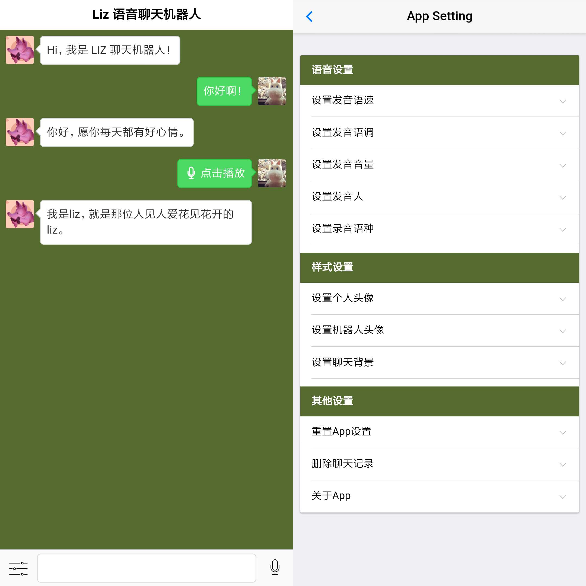

### 介绍

* chatbot是一款前后端分离的，能够进行智能聊天的手机APP应用

* 前端：使用DCloud出品的MUI框架开发手机APP，支持文字输入和语音输入，语音设置，切换主题，切换聊天头像等功能， 应用接收来自用户的文字或语音输入后，发送请求给服务器处理，接收处理结果后进行渲染，响应给用户 

* 后端：使用Go搭建HTTP服务，接收来自前端应用的请求，如果是语音请求，则会调用百度公司的语音识别技术(ASR)将语音，转换为文字信息，然后调用图灵机器人的自然语言处理技术获取到智能回答，返回给前端渲染，从而完成智能聊天

### 使用示例

